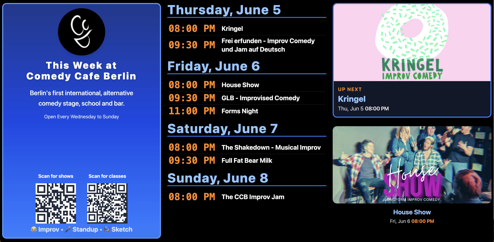
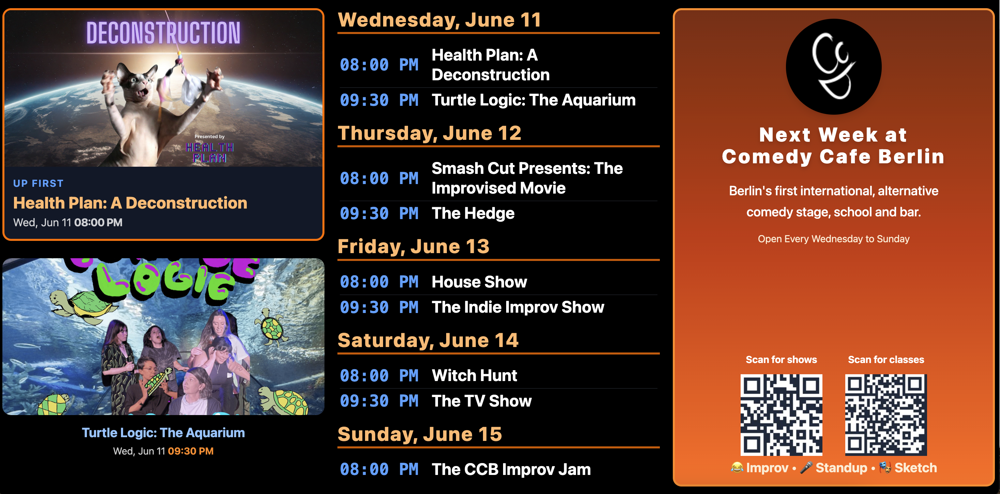

# Comedy Cafe Berlin Dashboard

A digital dashboard for Comedy Cafe Berlin, displaying upcoming shows and classes for both the current and next week. Designed for in-venue display screens, this project rotates between "This Week" and "Next Week" views, making it easy for visitors to see what's on at a glance.

## Features
- **Live schedule**: Pulls show and class data from an iCal feed and displays it grouped by day.
- **Dual week view**: Rotates automatically between "This Week" and "Next Week" every 30 seconds.
- **Modern, readable design**: Large, clear typography and QR codes for easy access to tickets and classes.
- **Color themes**: Blue for the current week, orange for next week.
- **Responsive**: Looks great on large screens in the venue.
- **Caching**: Efficient server-side caching for fast updates and low network usage.

## Screenshots

### This Week View


### Next Week View


---

# sv

Everything you need to build a Svelte project, powered by [`sv`](https://github.com/sveltejs/cli).

## Creating a project

If you're seeing this, you've probably already done this step. Congrats!

```bash
# create a new project in the current directory
npx sv create

# create a new project in my-app
npx sv create my-app
```

## Developing

Once you've created a project and installed dependencies with `npm install` (or `pnpm install` or `yarn`), start a development server:

```bash
npm run dev

# or start the server and open the app in a new browser tab
npm run dev -- --open
```

## Building

To create a production version of your app:

```bash
npm run build
```

You can preview the production build with `npm run preview`.

> To deploy your app, you may need to install an [adapter](https://svelte.dev/docs/kit/adapters) for your target environment.
